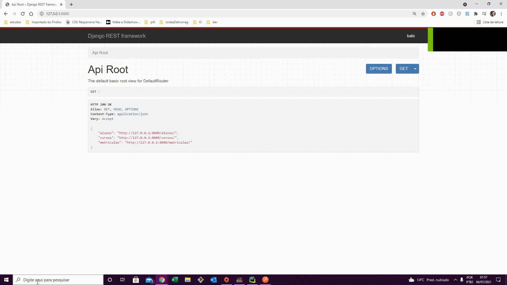

 <!-- Explicação do projeto -->
<h1 align="center">escola_API_django</h1>
<h2 align="center">Descrição do Projeto</h2>

 Desenvolvimento de um uma API em Python com o framework Django 

 <!-- Status do projeto -->
 <h2 align="center">Status</h2>
<h4 align="center"> 
	 ✅ API contruida em Python com Django REST Framework 🚀 Finalizado ✅
</h4>

<!-- Indice -->

 <a href="#objetivo">Objetivo</a> •
 <a href="#roadmap">Roadmap</a> • 
 <a href="#tecnologias">Tecnologias</a> • 
 <a href="#contribuicao">Contribuição</a> • 
 <a href="#licenc-a">Licença</a> • 
 <a href="#autor">Autor</a>

<!-- Tecnologias envolvidas -->

	<h2 align="center"> 🛠 Tecnologias envolvidas</h2>
	

		
		
		
		
	

<!-- Requirements -->

	<h2 align="center"> Pré-requisitos </h2>
	
$ pip install requirements.txt

	<ul>
		<li>asgiref==3.4.1</li>
		<li>Django==3.2.5</li>
		<li>python-decouple==3.4</li>
		<li>djangorestframework==3.12.4</li>
		<li>importlib-metadata==4.6.0</li>
		<li>Markdown==3.3.4</li>
		<li>pytz==2021.1</li> 
		<li>sqlparse==0.4.1</li>
		<li>typing-extensions==3.10.0.0</li>
		<li>zipp==3.5.0</li>
	</ul>

<!-- Resultados -->
<!-- Resultado API -->

	<h2 align="center"> ⚡ Resultados API ⚡</h2>

<!-- Resultados parciais -->

	<h3 align="center">  Acessando as urls de aluno e matricula </h3>
	

													
<!-- Resultados parciais -->

	<h3 align="center">  Acessando as urls das matriculas de cada aluno </h3>
	

<!-- Resultados parciais -->

	<h3 align="center">  Teste de acesso a API - Autenticação </h3>
	

													
													

